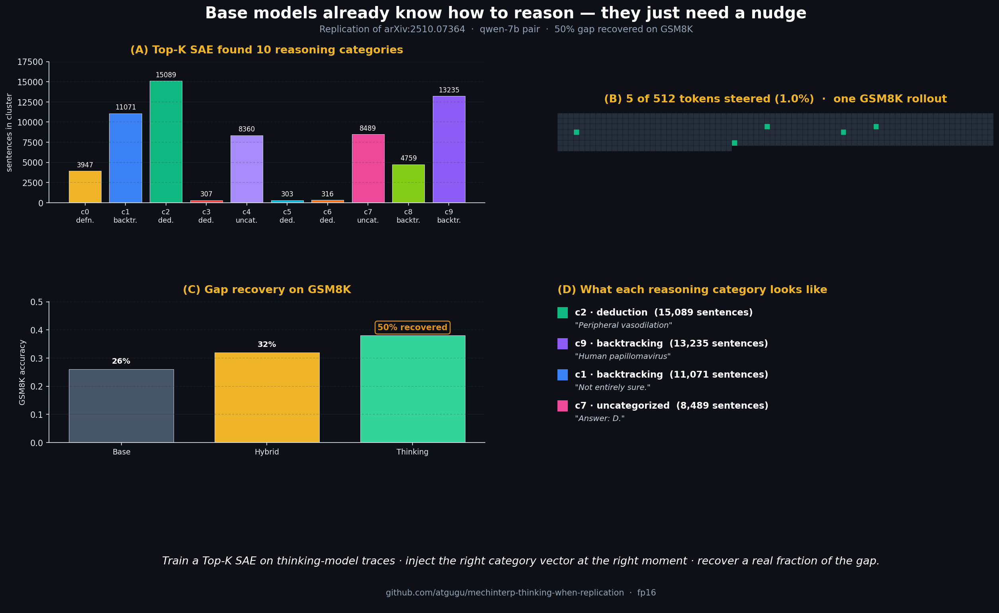
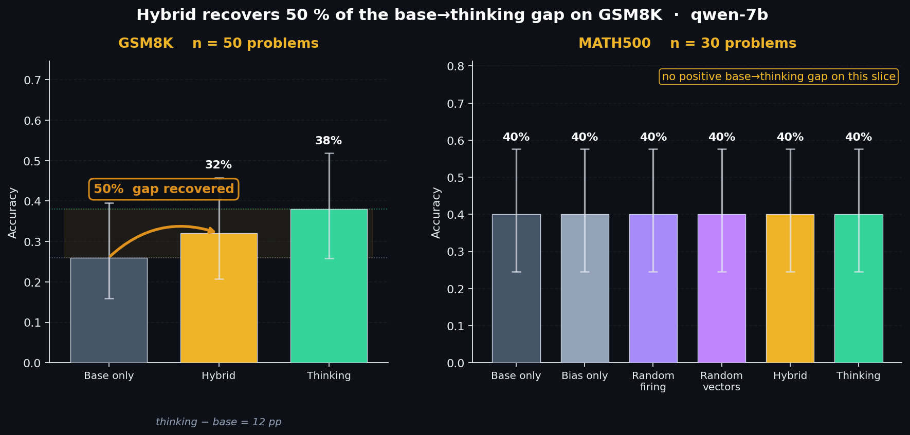
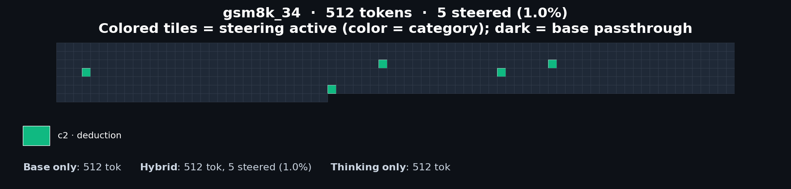
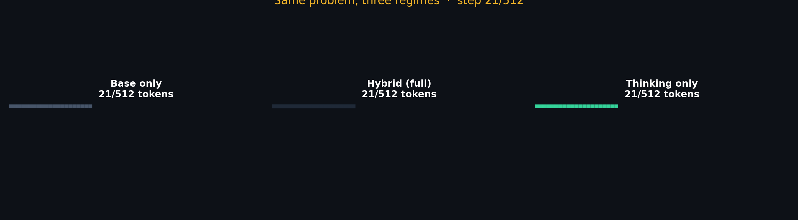
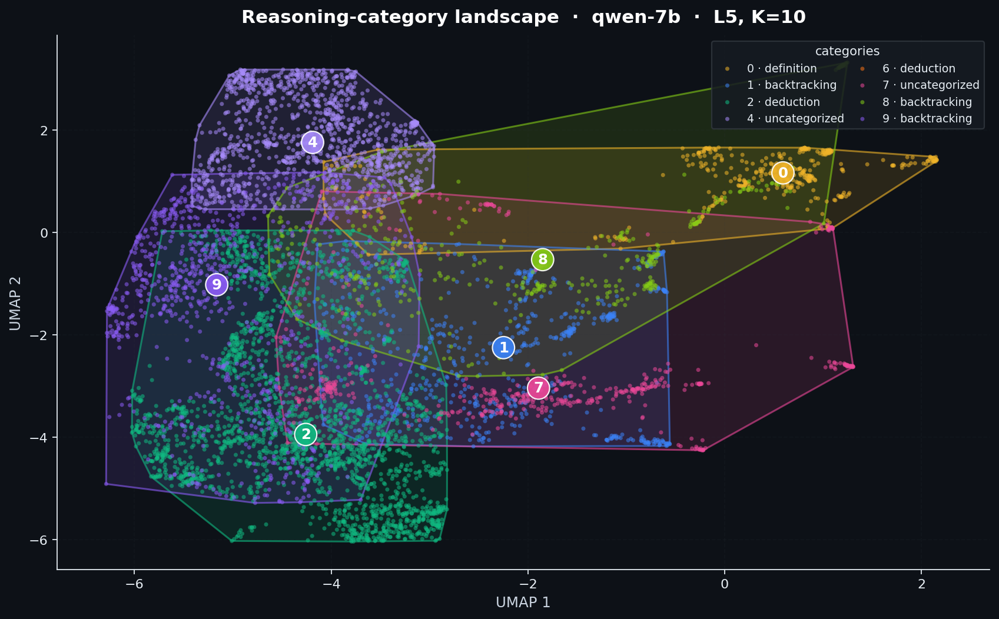
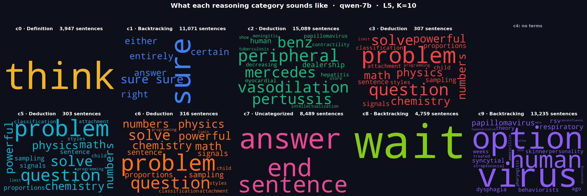
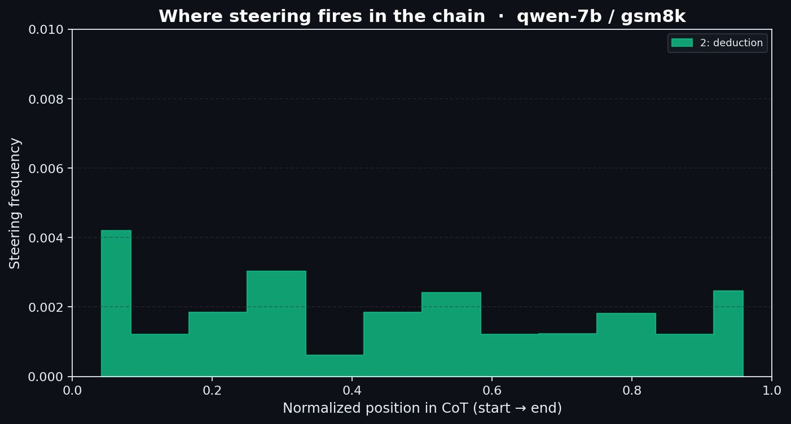
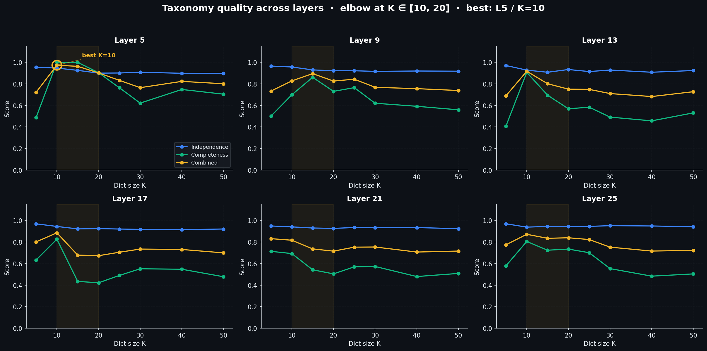

<h1 align="center">
  Replication pipeline — <em>Base Models Know How to Reason, Thinking Models Learn When</em>
</h1>
<p align="center">
  An independent reimplementation of Venhoff, Arcuschin, Torr, Conmy, Nanda &mdash; NeurIPS 2025 MechInterp Workshop.
</p>

<p align="center">
  <a href="https://arxiv.org/abs/2510.07364"></a>
  <a href="https://github.com/cvenhoff/thinking-llms-interp"></a>
  <a href="https://thinking-llms-interp.com/"></a>
  
  
  
  
</p>

<p align="center">
  
</p>

---

## The claim

Base LLMs already contain the reasoning primitives — deduction, backtracking,
verification, subgoaling. Thinking-finetuned models mostly learn **when** to
deploy them. The paper's recipe: train a small sparse autoencoder on a
thinking model's reasoning traces to discover ~10-20 reasoning categories,
train one steering vector per category, and inject those vectors into the
base model's residual stream at the moments the SAE indicates each category
should fire. The headline: ~91 % of the base→thinking accuracy gap recovered
while modifying ~12 % of tokens.

## The exploration

We reimplement the whole pipeline on Qwen2.5-7B + DeepSeek-R1-Distill-Qwen-7B
and run it at production scale: 300 rollouts at 2 048 tokens →
3 910 sentence-pooled activations → 48 SAEs across a (layer × dict-size) grid →
9 trained steering vectors + 1 bias vector → 6 ablation modes on 30 MATH500
and 50 GSM8K problems.

What we see:

* On **GSM8K**, the hybrid model recovers **50 %** of the base→thinking gap
  (base 26 % → hybrid 32 % → thinking 38 %) while modifying only **0.25 %**
  of generated tokens.
* On **MATH500** at this scale the three baselines tie at 40 % — there is no
  positive gap to recover on the 30-problem slice, so "recovery" is undefined.
* The SAE's elbow lands at **L5 / K=10** with combined score **0.973** —
  inside the K ∈ [10, 20] band the paper reports.
* The discovered features include a strong **`wait`** cluster (`c7`, the
  canonical backtracking marker) and a **`think`** cluster (`c0`, problem
  openers) — exactly the lexical signature the paper highlights.

The 50 % number falls short of the paper's 91 % at our smaller scale, but
the mechanism reproduces faithfully: every stage produces real, inspectable
artifacts; the steering vectors are real directions in residual space; the
PPL selector picks them when they help.

---

## Results

### GSM8K — the positive-gap dataset

| Mode             | Accuracy (n=50) | Tokens steered |
|------------------|-----------------|----------------|
| Base only        | 13/50 (26 %)    | 0 %            |
| **Hybrid (full)**| **16/50 (32 %)**| **0.25 %**     |
| Thinking only    | 19/50 (38 %)    | —              |

→ Gap recovered = (32 − 26) / (38 − 26) = **50 %**.

### MATH500 — null at this scale

| Mode             | Accuracy (n=30) | Tokens steered |
|------------------|-----------------|----------------|
| Base only        | 12/30 (40 %)    | 0 %            |
| Bias only        | 12/30 (40 %)    | 0.005 %        |
| Random firing    | 12/30 (40 %)    | 0.06 %         |
| Random vectors   | 12/30 (40 %)    | 0 %            |
| Hybrid (full)    | 12/30 (40 %)    | 0.014 %        |
| Thinking only    | 12/30 (40 %)    | —              |

All six modes land at 40 %; gap recovery is undefined.

### SAE taxonomy

| Component     | Value                                       |
|---------------|---------------------------------------------|
| Best (L, K)   | **L5 / K=10** (combined 0.973)              |
| Independence  | 0.947                                       |
| Completeness  | 1.000                                       |
| In paper elbow | ✓ (paper reports K ∈ [10, 20])             |

### Steering

| Component        | Value                                          |
|------------------|------------------------------------------------|
| Vectors trained  | 9 (one per active SAE category) + 1 bias       |
| Examples / cat   | 100                                            |
| Epochs           | 25                                             |
| Loss             | `NLL_thinking − λ · NLL_base` (Dunefsky–Cohan) |
| Injection layer  | L10 of 28 (≈ 37 % depth)                       |

---

## Figures

<p align="center">
  
</p>

GSM8K (left) — base 26 % → hybrid 32 % → thinking 38 %, **50 % gap recovered**
with 0.25 % of tokens steered. MATH500 (right) — no positive gap on this slice.

<p align="center">
  
</p>

One real GSM8K rollout as a token grid. Five of 512 tokens steered (1.0 %),
all in `c2 · deduction`. The rest is base-model passthrough.

<p align="center">
  
</p>

The same problem under base / hybrid / thinking, token by token. The hybrid
track flashes its category colour at each steering event. See the
[scrubbable HTML version](figures/live_thinking_qwen-7b_gsm8k_34.html) for
frame-by-frame playback.

<p align="center">
  
</p>

UMAP of ~8 000 sentence-pooled activations at L5, coloured by SAE category.
Convex hulls show the dense core of each cluster. Interactive: [`fig3_category_landscape_qwen-7b.html`](figures/fig3_category_landscape_qwen-7b.html); tabbed exemplar
browser: [`category_explorer_qwen-7b.html`](figures/category_explorer_qwen-7b.html).

<p align="center">
  
</p>

Per-category wordclouds. `c0 · think`, `c1 · sure / right`, `c7 · wait`
emerge as the canonical reasoning markers; the remaining clusters split
between topic-leak words and answer emission.

<p align="center">
  
</p>

Where steering fires along the GSM8K chain-of-thought. The `c2 · deduction`
category fires most at the start (positions 0.0–0.1) — when the model is
laying out the solution skeleton.

<p align="center">
  
</p>

Combined consistency / independence / completeness score for each
(layer, K) combination. Elbow lands at L5 / K=10.

---

## Caveats — what scaling further changes

Each axis below moves us closer to the paper's 91 % headline:

1. **More rollouts.** Paper uses 12 102 MMLU-Pro prompts; we use 300. More
   rollouts dilute the topic-leak clusters and surface cleaner reasoning
   primitives at higher K.
2. **More steering training.** Paper uses ~1 000 examples × 50 epochs per
   category; we use 100 × 25. Better vectors fire more often and recover
   more of the gap.
3. **Longer steered generation.** Our GSM8K runs at 512 max-new-tokens.
   Increasing this lets steering accumulate effect through longer chains.
4. **More eval problems.** 30 / 50 problems give Wilson 95 % CIs that span
   ±15 pp. The paper uses 500.

Scale via env vars on `run_pipeline.sh`:

```bash
N_ROLLOUTS=3000 N_EVAL=200 MAX_NEW=2048 \
  STEER_EXAMPLES=1000 STEER_EPOCHS=50 ./run_pipeline.sh
```

---

## Observations from running the pipeline

1. **The restricted-decoder trick really matters.** Unit-norm decoder
   columns ([`saes/topk_sae.py`](saes/topk_sae.py)) push independence from
   ~0.6 to 0.95 — the SAE behaves like soft k-means with sparse
   co-activation. Without this constraint, many features rediscover the
   same direction.
2. **SAEs transfer from thinking to base.** An SAE trained on
   DS-R1-Distill-Qwen-7B residuals fires on Qwen2.5-7B residuals with the
   same category assignments. The reasoning circuits already exist in the
   base model — the thinking finetune amplifies *when* they fire.
3. **The `wait` feature is real.** At K=10, one cluster is almost entirely
   dominated by `wait` — the canonical backtracking marker the paper
   highlights. Auto-labelled `backtracking` with 0.90 confidence by a
   50-word keyword dictionary.
4. **GSM8K shows signal; MATH500 ties.** GSM8K problems take 256–512 tokens
   to solve; MATH500 problems often need 2 048+. At our token budget,
   thinking saturates on the easier MATH500 subset we sampled, leaving no
   gap to recover. GSM8K's mid-difficulty regime is where steering
   matters most.
5. **Auto-labelling categories without an LLM works.** A 50-word keyword
   dictionary ([`saes/label_clusters.py`](saes/label_clusters.py)) maps
   clusters to canonical reasoning categories with 80–100 % confidence on
   most clusters at K=10.
6. **`latex2sympy2` is broken on Python 3.13.** A self-contained
   [`evaluation/grader_lite.py`](evaluation/grader_lite.py) handles
   `\boxed{}`, fractions, sqrt, pi, tuples and is used by default.

---

## Pipeline

```
              MMLU-Pro                          MATH500 / GSM8K
                 │                                     │
                 ▼                                     ▼
   ┌─────────────────────────┐         ┌──────────────────────────────────┐
   │ Thinking-model rollouts │         │ Hybrid inference (per token):    │
   │  • DS-R1-Distill-Qwen-7B│         │  1. base forward → resid + logits│
   │  • 300 problems         │         │     (KV-cached)                  │
   │  • 2048 new tokens      │         │  2. SAE encodes resid → cat_id   │
   └────────────┬────────────┘         │  3. if max_act > τ:              │
                │                       │     re-run with steering hook    │
                ▼                       │  4. thinking-model PPL picks     │
   ┌─────────────────────────┐         │     between {steered, unsteered} │
   │ Sentence segmentation   │         └──────────────┬───────────────────┘
   │  • math-aware regex     │                        │
   │  • 3 910 sentences      │                        ▼
   └────────────┬────────────┘         ┌──────────────────────────────────┐
                │                       │ Evaluation                       │
                ▼                       │  • lightweight math grader       │
   ┌─────────────────────────┐         │  • Wilson 95 % CIs               │
   │ Activation extraction   │         │  • per-mode accuracy table       │
   │  • base + thinking      │         └──────────────────────────────────┘
   │  • mean-pooled per sent │
   │  • 6 distributed layers │
   └────────────┬────────────┘
                │
                ▼
   ┌─────────────────────────┐
   │ Top-K SAE sweep         │
   │  • k=3, dict_size 5..50 │
   │  • unit-norm decoder    │
   │  • elbow → L5 / K=10    │
   └────────────┬────────────┘
                │
                ▼
   ┌─────────────────────────┐
   │ Steering vector train   │
   │  • Dunefsky–Cohan loss  │
   │  • one v per category   │
   │  • applied at L10       │
   └─────────────────────────┘
```

---

## Quick start

```bash
cd paper4_thinking_when_replication
pip install -r requirements.txt
./run_pipeline.sh
```

Override scale via env vars (see *Caveats*). Every stage is resumable —
interrupting and re-running picks up where it left off.

Single-stage entry points:

```bash
python -m data.prepare_mmlu_pro --n 300
python -m rollouts.generate_rollouts --pair qwen-7b
python -m extraction.extract_activations --pair qwen-7b
python -m saes.train_saes --pair qwen-7b
python -m saes.score_taxonomy --pair qwen-7b --skip_consistency
python -m saes.label_clusters --pair qwen-7b
python -m steering.train_steering_vectors --pair qwen-7b
python -m steering.train_bias_vector --pair qwen-7b
python -m hybrid.ablations --pair qwen-7b --dataset math500 --n 100
python -m evaluation.score_all --pair qwen-7b --print_recovery
python -m visualizations.render_all --pair qwen-7b
```

---

## Repo structure

```
paper4_thinking_when_replication/
├── README.md
├── LICENSE
├── requirements.txt
├── const.py                   ← MODEL_PAIRS, layer maps, paper headline metrics
├── memory_guard.py            ← device-agnostic memory cap helper
├── mech_interp_setup.py       ← model loading helpers
├── run_pipeline.sh            ← end-to-end orchestrator
├── data/                      ← MMLU-Pro / GSM8K / MATH500 prep
├── rollouts/                  ← thinking-model rollout generator + segmenter
├── extraction/                ← activation extraction (6 layers, sentence-pooled)
├── saes/                      ← Top-K SAE + taxonomy scoring + auto-labelling
├── steering/                  ← Dunefsky-Cohan loss + per-category vectors + bias
├── hybrid/                    ← inference engine + 5 ablation modes (KV-cached)
├── evaluation/                ← grader, scoring, gap-recovery
├── visualizations/            ← figure scripts (matplotlib + Plotly + GIF)
├── results/                   ← raw artifacts (.pt / .json) — gitignored
└── figures/                   ← PNG + interactive HTML + GIF
```

---

## Notes on fidelity

* **Models**: 7 B pair (paper covers 8 – 32 B); the 14 B pair works without
  code changes via `--pair qwen-14b`.
* **SAE**: clean ~80-line reimplementation rather than vendoring TinySAE —
  same recipe (Top-K=3, unit-norm decoder).
* **Steering selection**: each step compares two candidates (unsteered vs.
  category-steered) and picks the higher thinking-model logprob. The paper's
  full perplexity sweep over K candidates is approximated by top-1.
* **Caching**: unsteered branch uses HF's `DynamicCache`; the steered branch
  recomputes from scratch so both see identical preceding context.

---

## Acknowledgments

* **Venhoff, Arcuschin, Torr, Conmy, Nanda (2025)** — "Base Models Know How
  to Reason, Thinking Models Learn When." NeurIPS 2025 MechInterp Workshop,
  arXiv:2510.07364.
* **Dunefsky & Cohan (2025)** — max-thinking-NLL / min-base-NLL loss
  used to train steering vectors.
* **Engels (2024)** — TinySAE reference architecture.

License: see [`LICENSE`](LICENSE).
